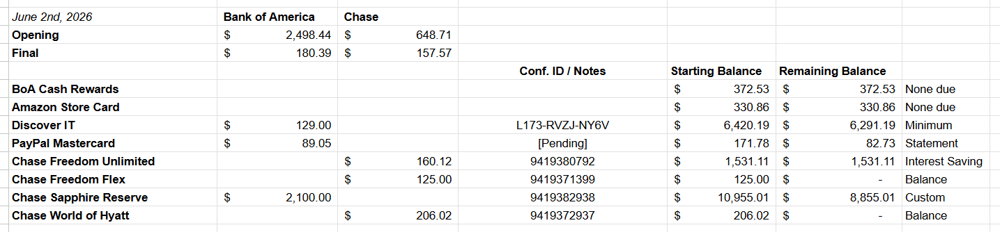

# Stashy

## Table of Contents
- [Stashy](#stashy)
  - [Table of Contents](#table-of-contents)
  - [Application Overview](#application-overview)
  - [User Workflow](#user-workflow)
    - [Sessions](#sessions)
      - [Sit Down (Begin New Session)](#sit-down-begin-new-session)
      - [Check Archive (Review Past Sessions)](#check-archive-review-past-sessions)
      - [Visit Whiteboard (Analysis View)](#visit-whiteboard-analysis-view)
  - [Data Model](#data-model)
    - [Anthony's Notes](#anthonys-notes)
 
## Application Overview

Stashy is a simple, local-first, privacy-focused app for tracking your sit-down sessions where you pay your credit cards. 

Initiate a sit-down, input the date, update your asset accounts, update your liability accounts, input your payment amounts, record your confirmation numbers, add your notes, and watch your asset balances update live as you work to avoid overdrafts. 

As a secondary side effect of this methodology, you unlock account-specific historical analysis using graph views, graph lines, and other powerful analysis tools.

Lastly, thought the app can be used on desktop, it should be just as easy to use on mobile devices.

## User Workflow
 
The main screen should be simple and have the following breakdowns:

- Sessions
  - Sit Down (Begin New Session)
  - Check Archive (Review Past Sessions)
  - Visit Whiteboard (Analysis View)
- Configuration
  - Edit Accounts
  - Save Data
  - Import Data

### Sessions

#### Sit Down (Begin New Session)

Here is an example of a real "sit-down" from my current Google Sheet method. I want to capture the same "feeling" in the UI though obviously which much needed improvements.

The real workflow I follow today goes as follows:
1. Update asset accounts at the top for the "Opening" row
2. For the liability accounts, update their "Starting Balance" column
3. Put in what I am going to pay for each liability account, lining up under the corresponding asset account I will pay from (the columns add then live subtract from the "Opening" balance and update the "Final" row)
4. The "Remaining Balance" column updates the moment I put in what I am paying in that given row
5. There are comments off to the right on if I paid the statement, balance, interest saving amount, etc.
6. Confirmation ID and Notes share a cell because I didn't want to make the table too big

The way I would like to work in Stashy is:
1. Set the date of the sit down
2. Update the opening balance of the asset accounts
3. Update the liability accounts for their account balance AND statement balance
4. For each liability account, select the source asset account payment is coming from
5. Have a place to put the payment amount as "full balance", "statement balance", or "custom"
   1. Full Balance - Sets the payment amount to the account balance
   2. Statement Balance - Sets the payment amount to the statement balance
   3. Custom - Sets the payment amount to whatever the user put in the payment amount box
6. The balance of the corresponding source asset account live updates visually
   1. The balance changes colors based on the thresholds set in that accounts settings (e.g. I can set my checking to go orange under \$200 and red under \$100, but could be green over \$500, etc.). User could also not set any if they want.
7. Input the confirmation ID (if applicable)
8. Update notes (if any)
9. Hit "Stand Up (Save)"

#### Check Archive (Review Past Sessions)

Checking the archive should simply provide a clean list showing the list of sit-downs from latest to oldest, top to bottom.

Clicking one will open it in view mode and you can hit "edit" to change things about it in the standard "sit down" view.

#### Visit Whiteboard (Analysis View)

This analysis view opens a dashboard showing the last known state of your assets and liabilities.

If you select a specific account, it will take you to a graph view of that account, showing the time-base history of the balance with your user-defined limit lines and other markers.

Below the graph, there will be a table basically showing the same information in tabular form.

If you click on a specific datapoint (graph or table), you will get a small tooltip which shows the date of the sit down, the balances, the payment amount, source account, confirmation ID, notes, etc. and also a button to view that session. You can also just X out the tooltip.

## Data Model

### Anthony's Notes

I believe that the data model tree should look as follows:

- Account
  - ID
  - Created/Edited
  - Type
  - Current Balance
  - Current Statement Balance
  - Payment Records (this contains the historical record of payments, deposits, or whatever I guess?)
- Session
  - ID (standard DB shit)
  - Created/Edited (standard DB shit)
  - Payment Records
- Payment Record
  - Account
  - Date
  - Starting Balance
  - Statement Balance
  - Payment Amount
  - Source Account
  - Confirmation ID
  - Notes

Blah blah. I want to keep the hierarchy flat so we can just pass IDs around and let the code easily retrieve the corresponding information swiftly instead of burying everything in bureaucracy.