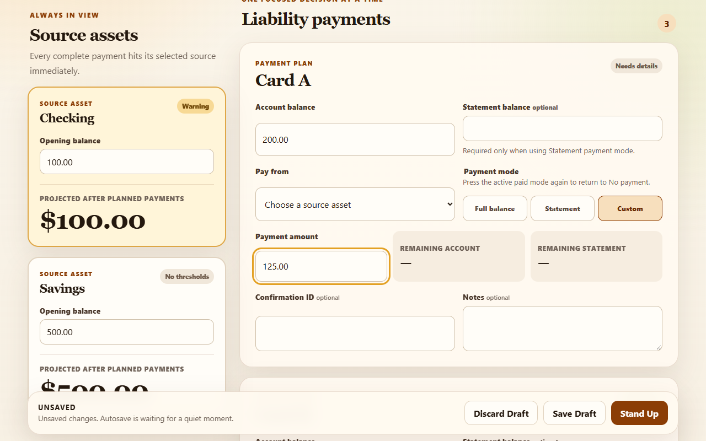
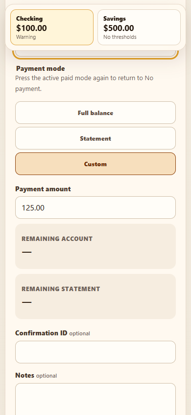
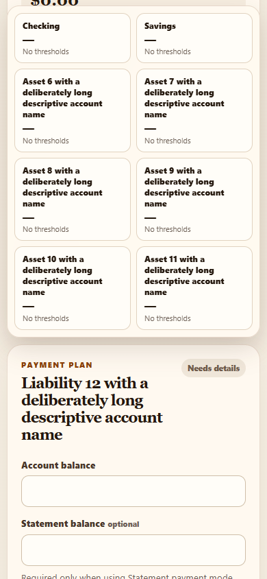

# Phase 8 implementation plan and engineering review

Prepared October 4, 2026. Planning baseline: `5d42e42` (`Fixed the import issue???`).

**Status:** proposed implementation plan, with decisions recorded from Anthony during this review. No application source, tests, dependencies, or deployment settings were changed. Phase 8 and MS-01 are not declared complete.

## 1. Recommendation and product contract

Fix projection trust and loss of unsaved work first. Then harden writing from multiple tabs, make warnings and recovery accessible, refine the cockpit for the MacBook and Fold, and complete offline, hosting, documentation, and release evidence. Preserve the working money model, normalized records, historical isolation, and `.stashy` restore implementation.

The most important clarification from Anthony is that **payments happen while the session is open**. He does not enter a complete plan and then execute it. A warning at Stand Up therefore arrives too late to prevent an external payment mistake. During every payment decision, Stashy must communicate the selected source, its running balance, and any reason that balance is incomplete. Stashy cannot observe a bank payment or infer which asset actually funded an unassigned row.

The supplied [handoff](PHASE_8_HANDOFF.md) is evidence and a proposed direction. Its “next model” assignment does not independently authorize application changes or publishing. This report fulfills the request to review and plan. The handoff identifies Phase 8 as the target; that is the planning scope here. Future implementation must receive Anthony's active-phase instruction and retain the repository's phase boundaries.

Product intent remains in [the design](DESIGN_DOC.md); delivery and acceptance remain in [the roadmap](MVP_ROADMAP.md#phase-8--responsive-ux-accessibility-and-release-hardening). Approved persistence decisions remain in [architecture](ARCHITECTURE.md). This plan distinguishes agreed choices, recommendations, and questions; it does not silently amend those authorities.

### Decisions already established

| Topic                       | Agreed direction                                                                        | Implementation implication                                                                                                       |
| --------------------------- | --------------------------------------------------------------------------------------- | -------------------------------------------------------------------------------------------------------------------------------- |
| Priorities                  | Overdraft prevention, entry speed, clean history, then analysis                         | Safety work precedes cosmetic refinement.                                                                                        |
| Payment sequence            | Anthony makes payments as he works through the session                                  | Source and projection warnings appear during entry, before Stand Up.                                                             |
| Visual scope                | Refine the current cockpit and branding                                                 | Reuse the existing shell, cards, tokens, and account-history presentation.                                                       |
| Incomplete projections      | Keep exact deductions from complete rows visible, with prominent incomplete warnings    | Introduce explicit projection completeness; remove reassuring Healthy status on affected partial results.                        |
| Missing-source interaction  | Immediate warning and a “Choose source” action; do not automatically move focus         | Warn as soon as a paid mode lacks a source. Focus moves only after the user invokes the action or submits invalid data.          |
| Narrow-screen liabilities   | One expanded liability with summaries of the others                                     | Expansion is presentation state; calculations and draft saving still use every row.                                              |
| Critical source information | Running balances; sources plus the liability currently being edited                     | Compact balance summaries take precedence over large sticky opening-balance forms.                                               |
| Target devices              | Brave on an Apple Silicon 13-inch MacBook Air and Samsung Z Fold8                       | Test laptop, folded, unfolded, landscape, keyboard, and fold transitions. Exact CSS viewports still need measurement.            |
| Phone posture               | Any Fold mode may be used                                                               | Preserve inputs and active liability through resizing.                                                                           |
| Offline scope               | Whole core workflow after initial app assets finish loading, including unopened routes  | Load required route code before claiming that this scope is ready. Cold offline reopening remains deferred.                      |
| Unsaved recovery            | Warn before leaving; recover the last saved draft                                       | Invalid raw text need not persist across restart. No second draft storage system is planned.                                     |
| Multiple tabs               | One writable tab; additional tabs available for viewing                                 | Protect all mutations and provide deliberate ownership handoff. No concurrent editing/merge behavior is required.                |
| Hosting                     | Expected URL resembles `https://cafecitoexpress95.github.io/stashy`                     | The existing remote is `CafecitoExpress95/Stashy`; derive the base from that actual repository name and verify final URL/casing. |
| Device migration            | Export `.stashy` for longer-term migration; fresh backups can move through Google Drive | Document one authoritative copy and full replacement on restore. No Drive integration or synchronization is requested.           |
| Earlier user trials         | Whiteboard and backup/restore were OK                                                   | Preserve their working behavior; repeat affected journeys for the final candidate.                                               |

Established MS-01 exclusions still apply: budgeting, bank integration, payment-status tracking, reminders, transaction import, split payments, multi-user support, encryption, cloud sync, and a generalized ledger. A polished audit browser and cold-start offline installation remain deferred.

### Additional hosting decision

Anthony selected a **manual release action** for GitHub Pages. Merging or pushing to main should not automatically publish. This is approval of the planned trigger, not authorization to publish during this review.

## 2. What this review independently verified

I built the current production output and ran diagnostic browser probes using the installed Windows Brave executable, headless, in isolated temporary profiles with fabricated data. These probes did not use Anthony's real browser profile or financial data. They are stronger evidence than source inspection alone, but they are not manual acceptance on the MacBook or Fold.

The observations are preserved in [planning evidence](PHASE_8_PLANNING_EVIDENCE.json). Screenshots show actual current behavior, not proposed designs.

| Finding                                                               | Observation                                                                                                                                                                                                                                                          | Classification                                                                                                      |
| --------------------------------------------------------------------- | -------------------------------------------------------------------------------------------------------------------------------------------------------------------------------------------------------------------------------------------------------------------- | ------------------------------------------------------------------------------------------------------------------- |
| Missing source is not explicitly warned about during entry            | Checking opened at `$100.00`; Card A had Custom `$125.00` with no source. The card showed “Needs details”; Checking still showed `$100.00`. No explicit missing-source or excluded-payment warning appeared. The source select had no error description association. | Release blocker: hidden projection risk.                                                                            |
| Current Stand Up does reject that incomplete paid row                 | Attempting Stand Up kept the dialog closed and focused the source select. Selecting Checking immediately produced `-$25.00` and an overdraft warning.                                                                                                                | Existing safeguard to retain. Does not resolve the earlier entry hazard.                                            |
| Missing opening balance on another source suppresses valid deductions | After Checking correctly showed `-$25.00`, a second paid row used Savings. Clearing Savings' opening balance made Checking revert to `$100.00`, removing its overdraft warning.                                                                                      | Release blocker: a valid known negative result becomes misleading.                                                  |
| Draft edit is lost inside the debounce interval                       | Starting from a saved draft, editing Notes and navigating away took 24 ms. No leave dialog appeared. Resuming the draft returned an empty note.                                                                                                                      | Release blocker: silent loss of work.                                                                               |
| Invalid raw text can be abandoned without warning                     | Replacing a saved `$100.00` opening with invalid text paused autosave. Navigation gave no warning; reopening restored `$100.00`.                                                                                                                                     | Release blocker for silent abandonment. Recovery of the saved value is correct.                                     |
| Multiple writable tabs can erase committed work                       | Both tabs opened the same saved draft. Tab A saved a confirmation ID. Tab B saved a note from its older snapshot. Reloading A showed the note but an empty confirmation ID.                                                                                          | Release blocker under concurrent editing; policy and protection must be explicit.                                   |
| Tall source summaries obscure entry                                   | Eight assets and twelve liabilities with long names produced a 483.875 px mobile dock at 390 × 844. At 390 × 400, the dock was taller than the viewport. Horizontal overflow was zero despite the obstruction.                                                       | Responsive/accessibility phase blocker; becomes release-blocking when it hides safety information or core controls. |
| Home loading does not make unopened routes work offline               | After Home hydrated in a fresh context, blocking requests and keyboard-opening Archive failed to show Archive. Its JavaScript chunks still needed the network.                                                                                                       | Phase blocker under the offline scope Anthony selected.                                                             |
| Historical correction guard worked in the exercised case              | A synthetic cancelable unload event did not warn for pristine history, did warn after an edit, and an actual internal navigation was canceled when confirmation returned false. A separate correction save navigated successfully.                                   | Preserve and expand coverage; no correction-guard failure claimed.                                                  |

The correction probe also checks a concern raised during inspection: `editRevision` currently is an ordinary variable used by a derived guard. The exercised guard worked; this report does not label it broken. The proposed committed/current revision contract should nevertheless use explicit reactive state and test successive clean/dirty transitions.

Anthony recalls realizing the source mistake after standing up. The current missing-source reproduction could not stand up. The original build, exact payment mode, and row state remain unknown. Do not rewrite his account of the incident, assert a reproduced completion bypass, or presume user error. Reproduce the workflow on the candidate build and check that a paid row cannot silently become No payment or lose its source through mode changes.

### Visual evidence

The current desktop presents a complete-looking running balance while the custom amount is excluded:



The current mobile dock likewise has no indication that a paid row is excluded:



The stress fixture makes the dock consume most of the entry space:



These are provisional CSS viewports. A 390 × 400 viewport tests constrained height; it does not reproduce Android's actual virtual keyboard. Eight assets and twelve liabilities are stress fixtures, not Anthony's reported account counts or proposed product limits.

## 3. Implementation boundaries and touch map

Search the relevant subtree before adding anything. Read the root and applicable ancestor `AGENTS.md` files for each slice. Keep route navigation/orchestration in `src/routes`, pure calculations in `src/lib/domain`, reusable presentation in `src/lib/components`, and IndexedDB behavior in `src/lib/persistence`.

| Existing owner                                                                                                                                                                                                | Planned touch                                                                                                                                | Why and scope                                                                                                                                              |
| ------------------------------------------------------------------------------------------------------------------------------------------------------------------------------------------------------------- | -------------------------------------------------------------------------------------------------------------------------------------------- | ---------------------------------------------------------------------------------------------------------------------------------------------------------- |
| [domain/cockpit.ts](../src/lib/domain/cockpit.ts)                                                                                                                                                             | `deriveCockpit`, asset/payment view contracts, draft/final assembly                                                                          | Expose completeness and exclusions; remove optimistic display fallback; keep final snapshots strict.                                                       |
| [domain/validation.ts](../src/lib/domain/validation.ts)                                                                                                                                                       | Payment-reference validation and draft projection assembly                                                                                   | Preserve deductions on unaffected assets when another source opening is missing. Keep duplicate/reference failures distinct from ordinary draft omissions. |
| [domain/calculations.ts](../src/lib/domain/calculations.ts)                                                                                                                                                   | Targeted reuse, with changes only if required by the chosen projection boundary                                                              | Continue exact checked subtraction and structural validation. Do not weaken the calculation API to make an incomplete UI look complete.                    |
| [sit-down route](../src/routes/sit-down/+page.svelte)                                                                                                                                                         | `paymentFieldError`, dirty/save contract, navigation guards, `queueDraftSave`, dialog/discard/new-session transitions, expanded liability ID | Own form lifecycle, user-controlled focus, and route-local responsive state.                                                                               |
| [LiabilityPaymentCard](../src/lib/components/LiabilityPaymentCard.svelte)                                                                                                                                     | Immediate source warning, error IDs/descriptions, compact summary/expansion presentation                                                     | Keep callbacks and form data presentation-only. Collapsing does not change a payment.                                                                      |
| [AssetProjectionPanel](../src/lib/components/AssetProjectionPanel.svelte) and [AssetProjectionDock](../src/lib/components/AssetProjectionDock.svelte)                                                         | Completeness language, compact running balances, bounded layout, reliable risk visibility                                                    | Both render the same domain view. Neither computes an alternate balance.                                                                                   |
| [Accounts route](../src/routes/configuration/accounts/+page.svelte), [AccountEditor](../src/lib/components/AccountEditor.svelte), [ThresholdDefaultsForm](../src/lib/components/ThresholdDefaultsForm.svelte) | Dirty/pending callbacks, abandonment policy, editor focus, field-error associations, appropriate action-message severity                     | Preserve entered configuration after failure and avoid silent replacement when switching editors.                                                          |
| [AppShell](../src/lib/components/AppShell.svelte), [root layout](../src/routes/+layout.svelte), [app.css](../src/app.css)                                                                                     | Skip link, presentation of application readiness/write ownership if needed, focus tokens, motion, density and sticky clearance               | Root layout owns startup/browser orchestration; shell remains reusable presentation.                                                                       |
| [Whiteboard route](../src/routes/whiteboard/+page.svelte)                                                                                                                                                     | Return focus from closing a detail panel, responsive/focus verification                                                                      | Keep exact history table and saved-snapshot semantics. Chart adapter changes only for a measured presentation defect.                                      |
| [Save & Restore workspace](../src/routes/configuration/data/DataPortabilityWorkspace.svelte)                                                                                                                  | Applicable write-ownership checks, pending restore/navigation state, clear saved-data/export recovery language                               | Preserve `$state.raw` prepared archives and existing atomic replacement.                                                                                   |
| [persistence repositories](../src/lib/persistence/AGENTS.md)                                                                                                                                                  | Enforce the chosen single-writer permission across all mutation entry points                                                                 | Existing serialization handles one route's queue; it does not protect against stale snapshots in another tab. No second database is planned.               |
| [Playwright configuration](../playwright.config.ts), [preview runner](../scripts/run-e2e.mjs), [browser tests](../tests/e2e/AGENTS.md), domain/repository tests                                               | Explicit desktop/mobile projects, safety regressions, dialog/focus and offline cases, base-path tests                                        | Reuse production output and deterministic fabricated fixtures.                                                                                             |
| [vite.config.ts](../vite.config.ts), optional `.github/workflows/` and `static/.nojekyll`                                                                                                                     | Project base and reviewable Pages packaging/deployment configuration                                                                         | Use the existing repository identity, verify the actual Pages path, and settle the deployment trigger. No publication is part of this review.              |
| [README](../README.md), [architecture](ARCHITECTURE.md), targeted [roadmap](MVP_ROADMAP.md) sections                                                                                                          | Current setup/recovery/hosting instructions and explicit version terminology                                                                 | Correct stale prose without changing working storage to fit it.                                                                                            |
| Relevant local maps                                                                                                                                                                                           | Material ownership, exported contract, and invariant changes only                                                                            | No private-helper inventories or chronological log entries.                                                                                                |

No default changes are planned to `money.ts`, persisted domain record shapes, database migrations, selectors/history semantics, archive file layout, branding assets, or Chart.js. If a verified defect requires one, state the reason and add the appropriate regression before expanding the slice.

## 4. Slice A — projection trust and source warnings

**Order:** first. **Class:** release blocker. **Depends on:** agreed partial-result and warning-interaction choices; no remaining aesthetic decision should delay the underlying contract.

### Before and after

Before: a paid row missing a source looks merely unfinished; a displayed balance can exclude it without saying so. Another source's missing opening can cause even valid deductions to disappear.

After: a paid row without a source immediately says **“Choose a source — this payment is excluded from running balances.”** Its “Choose source” action focuses the existing select. The rail/dock persistently says **“Incomplete — payments excluded”** and provides an accessible way to find the affected row. Complete rows continue to subtract exactly. A known negative result stays prominent while other work is incomplete.

Proposed copy is concrete but still open to tone refinement. Do not invent a total amount for excluded payments when their amounts are unknown.

### Calculation and view contract

Use the existing pure adapter and validation boundary to produce two separate facts: the exact value available from resolved rows, and whether that value accounts for all relevant paid rows. These are transient view facts, not new persisted columns.

| Situation                                                                             | Numeric result                                                                   | Trust/risk presentation                                                                                                            |
| ------------------------------------------------------------------------------------- | -------------------------------------------------------------------------------- | ---------------------------------------------------------------------------------------------------------------------------------- |
| Opening entered; every relevant paid row complete                                     | Exact opening minus those payments                                               | Normal threshold/zero/negative behavior.                                                                                           |
| Paid row has no source                                                                | Keep exact deductions from resolved rows                                         | Global incompleteness affects every asset because the missing source is unknown. No affected asset may appear unqualified Healthy. |
| Paid row has a valid known source but a required amount/balance is missing or invalid | Keep other resolved deductions                                                   | Mark the selected asset incomplete; global summary explains the exclusion.                                                         |
| Selected source has no valid opening balance                                          | No result for that asset                                                         | Request an opening balance; do not fall back to a reassuring value. Other assets retain their valid deductions.                    |
| Malformed optional statement text or invalid date                                     | Preserve available independent money results only with accurate field/save state | Explain whether the issue affects calculation, saving, or both. Do not call an unsavable row complete.                             |
| Intentional No payment                                                                | Zero debit; no source required                                                   | No missing-source warning, even with confirmation/notes. Missing liability balance remains a completion/input issue.               |
| Duplicate liability rows or structurally invalid references                           | No asserted final projection where attribution is unsafe                         | Preserve structural validation. Do not apply a duplicated debit or silently guess an account.                                      |
| Partial result already below zero                                                     | Exact known result still visible                                                 | Overdraft warning remains stronger than the incompleteness label. Neither suppresses the other.                                    |
| Partial result is zero or positive                                                    | Value is labeled partial                                                         | Do not suggest the account is safe merely because excluded work has not been applied.                                              |

An excluded negative payment can also change the result. Therefore a partial balance is not automatically an upper bound, lower bound, or conservative estimate. Keep the existing allowance for negative, zero, and overpayment records; those financial states warn without blocking valid messy records.

Implementation should fix the current global suppression caused by `sourceOpeningIsAvailable = false`. Reuse exact projection calculation over attributable resolved rows and available openings while separately carrying exclusion reasons. Keep the all-or-nothing structural guard for duplicates and genuinely invalid source references. Do not simply remove the guard or calculate money again inside a component.

Separate UI results from stored draft semantics. A saved draft may remain incomplete under existing record contracts. Replay must distinguish opening/available draft values from completed final projections, ideally by hydrating and re-deriving draft completeness rather than trusting a legacy draft `finalBalance`. Stand Up and historical corrections still require resolved records and complete exact snapshots. Old completed sessions and later sessions must not be recalculated by this change.

### Warning interaction and accessibility

- Render a persistent source warning immediately upon entering a paid mode with no source, including Custom before an amount is typed.
- Keep ordinary incomplete No payment rows quiet about sources.
- Make warnings survive source clearing, collapsing the card, resizing, autosave, and draft reload.
- Combine a field description, a row-level safety cue, and a global incomplete summary. Use one primary announcement per new problem; avoid simultaneous duplicate live-region announcements from desktop and mobile copies.
- Make “Choose source” reveal a collapsed row, then focus the select after DOM update and scroll it clear of sticky content.
- Preserve paid-mode toggle/deselect behavior unless Anthony explicitly changes it. Test it because turning a row back to No payment clears source and custom amount today.
- Do not silently assign the first, last-used, or only available asset. Do not infer a bank payment from notes or a confirmation ID.

### Alternatives considered

| Option                                                    | Benefit                                        | Cost / disposition                                                                  |
| --------------------------------------------------------- | ---------------------------------------------- | ----------------------------------------------------------------------------------- |
| Keep clearly labeled partial results                      | Retains useful running deductions during entry | Requires explicit completeness and warning design. **Chosen.**                      |
| Hide every projection until all paid rows are complete    | Simple conservative presentation               | Removes useful information while working. Not chosen.                               |
| Automatically focus source on paid-mode selection         | Makes the next required control immediate      | Can interrupt mode/amount entry and keyboard flow. Not chosen.                      |
| Preserve focus, provide warning and explicit focus action | Catches the hazard without stealing focus      | Action must be easy to find and tested. **Chosen.**                                 |
| Default a source account                                  | Faster in a common case                        | Can debit the wrong account and conceal the very mistake being fixed. Not proposed. |

### Required evidence before this slice is accepted

Add unit and browser regressions for each paid mode without a source before any Stand Up attempt; selecting, clearing, and changing sources; incomplete/invalid openings on a different asset; known-source unresolved amounts; structural failures; draft save/reload; and intentional No payment. Assert visible warnings and exact values, not merely that an issue code exists.

Include `$100.00` minus `$125.00` becoming `-$25.00`, then clear another source's opening and verify the negative result and warning remain. Retain canonical `$324.80`, exact penny subtraction, strict threshold boundaries, non-blocking overpayment, and later-session isolation. Stand Up must continue to reject an unresolved paid row.

## 5. Slice B — unsaved work and lifecycle transitions

**Order:** second. **Class:** release blocker. **Owners:** sit-down route first, then configuration forms and pending restore transitions. **Depends on:** chosen last-saved-draft recovery scope.

### Committed versus current state

For each active form/session, track a reactive current edit revision and the revision actually committed by IndexedDB. A queued save captures its own immutable normalized snapshot, session identity, and revision. It becomes committed only after the repository reports transaction completion.

If revision 4 commits while revision 5 is on screen, revision 5 remains unsaved. Failure never advances the committed revision. A response for an old session cannot mark a newly opened form clean. Save status reflects current work, not whichever asynchronous callback most recently completed.

A revision difference is a conservative signal, but reverting to the saved content should not warn unnecessarily. Retain a transient committed content baseline or narrowly scoped content comparison excluding timestamps and IDs. Treat invalid raw input as meaningful unsaved content; equivalent valid money formatting should not create a financial change. Do not build a generic form framework or persist these baselines elsewhere.

An untouched new form is not dirty just because it has never been saved. A new blank draft successfully created by Start New Sit-Down is already committed. Invalid raw input remains only on screen; reopening intentionally returns the last committed draft.

### Leave and action policy

| Transition                                                         | Proposed behavior                                                                                                                                                                    |
| ------------------------------------------------------------------ | ------------------------------------------------------------------------------------------------------------------------------------------------------------------------------------ |
| Internal navigation / browser Back with dirty draft or corrections | Cancel navigation while asking whether to stay or leave without guaranteed latest changes. Staying preserves input and autosave scheduling.                                          |
| Internal navigation after current content committed                | Proceed without warning.                                                                                                                                                             |
| Reload, close, external navigation                                 | Request the native unload warning only while meaningful unsaved work exists. Do not depend on an async unload save.                                                                  |
| Browser/process kill or mobile app-manager closure                 | Recover whatever was already committed. Do not promise a warning or preservation of uncommitted raw text.                                                                            |
| Pending save                                                       | Remain dirty until acknowledgment. A user who leaves may lose the latest edits; a transaction already in progress may still finish. Do not promise that “leave” rolls it back.       |
| Invalid/failed save                                                | Leave warning remains active. Retry retains current entries. Explain that the saved draft is safe and newer input is not committed.                                                  |
| Open Stand Up, then Keep Sitting / Escape                          | Restore valid dirty-draft autosave scheduling; opening the dialog currently clears the timer.                                                                                        |
| Confirm Stand Up while saving                                      | Freeze relevant editing/transition controls; Escape must not reset the in-flight flag or permit a second commit.                                                                     |
| Successful Stand Up / correction save                              | Clear dirty state only after commit; show receipt/replay and place focus appropriately without a second leave prompt.                                                                |
| Failed Stand Up / correction save                                  | Keep input and dirty protection; announce failure and offer retry.                                                                                                                   |
| Discard Draft                                                      | Distinct explicit deletion confirmation; wait for relevant queued writes, delete atomically, then clear baseline and show fresh form. Failure preserves the draft and current input. |
| Cancel corrections                                                 | Confirm abandonment once, navigate deliberately, retain saved history.                                                                                                               |
| Start New Sit-Down                                                 | Commit a distinct blank draft before replacing the receipt. Failure leaves the receipt available.                                                                                    |
| Account editor Cancel, Close, Add, or edit another account         | Protect meaningful unsaved changes before replacing the current editor.                                                                                                              |
| Changed default thresholds                                         | Warn on route/unload abandonment; successful save establishes the new baseline.                                                                                                      |
| Configuration save in progress                                     | Disable destructive/switching actions and either freeze fields or retain revision-aware later edits; do not close a newer edited form when an older request completes.               |
| Backup review only                                                 | Leaving may discard the selected file/review, but not local records; no financial-data-loss warning solely for selecting a file.                                                     |
| Restore in progress                                                | Guard navigation consistently while the atomic replacement is pending; show success only after commit and reload dependent views.                                                    |

Use the installed SvelteKit navigation API's distinction between internal navigation and document unload to avoid duplicate prompts. Browser unload text is controlled by the browser, and mobile unload events are not reliable; attach dirty-only protection and preserve the committed baseline. These constraints are documented by [SvelteKit navigation](https://svelte.dev/docs/kit/$app-navigation) and [MDN beforeunload](https://developer.mozilla.org/en-US/docs/Web/API/Window/beforeunload_event).

Current installed SvelteKit is `2.63.0`. Verify APIs against installed source/types before coding; online documentation now contains newer API examples.

### Internal-warning options

| Option                                                                    | Tradeoff                                                                                               | Recommendation                                                                                                 |
| ------------------------------------------------------------------------- | ------------------------------------------------------------------------------------------------------ | -------------------------------------------------------------------------------------------------------------- |
| Reuse `window.confirm` for Stay/Leave                                     | Smallest change; native button labels are less explicit                                                | Suitable first implementation of the agreed warning/recovery policy.                                           |
| Small shared native `<dialog>` with explicit Keep Sitting / Leave actions | Clearer wording and keyboard context; adds focus/one-shot navigation handling                          | Prefer if the native confirmation feels ambiguous in review. Build only the concrete shared behavior required. |
| Save & Leave as a third action                                            | Convenient for valid work, but requires asynchronous retry, failure, revision, and invalid-input rules | Optional follow-up; not required for the chosen recovery scope.                                                |

Use a narrowly scoped, one-use confirmed-navigation intent if necessary. Do not leave a permanent bypass flag that suppresses later guards. A rejected leave must not stop autosave or discard input. Browser-level unloading must not attempt to open a custom dialog.

### Required regressions

Test dirty valid edits before 800 ms, in-flight commits followed by newer edits, invalid dates/money, failed writes/retry, pristine and fully committed navigation, reverting to saved content, stay/leave decisions, real reload/close dialogs, reopening the last saved draft, dialog cancellation, failed/successful Stand Up, cancel/save corrections, discard failure, and distinct new draft IDs. Extend existing failure hooks rather than add production-only test controls.

For configuration, test unsaved Cancel/switch editor/navigation, dirty thresholds, failure recovery, and cancellation/editing during an in-flight save. For history, verify audit atomicity and unchanged later sessions. Synthetic events support logic tests; native dialogs and actual close/reopen behavior require browser tests and manual Brave checks.

## 6. Slice C — multiple-tab writing safety

**Class:** release blocker because committed changes were erased in the reproduced two-tab case. **Decision:** Anthony selected one writable tab, with additional tabs available for viewing.

This is same-user local data protection, not multi-user functionality. Serializing one route's saves and using atomic IndexedDB transactions does not stop a second tab from submitting an older complete snapshot.

| Approach                                                       | Benefit                                                                                         | Cost / risk                                                                                                                                                                                                      |
| -------------------------------------------------------------- | ----------------------------------------------------------------------------------------------- | ---------------------------------------------------------------------------------------------------------------------------------------------------------------------------------------------------------------- |
| One writable tab; other tabs view-only                         | Clear ownership and a small product contract; also prevents restore versus edit collisions      | Requires application-wide write permission, explicit handoff, and refresh before a viewing tab starts editing. **Chosen.**                                                                                       |
| Concurrent editors with transaction-level stale-save rejection | Allows independent editing; can preserve both tabs' current input for a deliberate reload/retry | Must compare the expected stored state inside the same write transaction. Own queued saves, correction audits, configuration, discard, and full restore complicate the contract. No automatic merge is proposed. |
| Document “use one tab” without enforcement                     | Minimal code                                                                                    | Leaves the reproduced silent data loss possible. Insufficient as the primary safety fix.                                                                                                                         |

For the chosen approach, evaluate a single named origin-scoped Web Lock held by the writable tab. Additional tabs can read saved views but cannot autosave, correct history, mutate configuration, discard, or restore. Present a clear view-only notice and an explicit handoff. Never steal a lock from a tab with pending or dirty work. Drain writes and obtain the owner's decision before voluntary release; after acquisition, reload authoritative state before enabling editing.

Treat ownership as explicit checking/writer/viewer/unavailable state; checking is not permission to write. Coordinate first-run configuration initialization and editable-route startup with acquisition so an on-mount race cannot enable two writers. Keep ownership transient; no persisted lock record or database version change is needed.

The [Web Locks API](https://developer.mozilla.org/en-US/docs/Web/API/Web_Locks_API) coordinates ownership across same-origin tabs in secure contexts. Verify availability and behavior on the actual Brave devices. Define a safe unavailable-API state instead of silently allowing two writers. Backgrounding a phone is not equivalent to safely releasing ownership; do not drop a lock merely because the document becomes hidden.

Keep the capability in one small reusable browser module if needed, orchestrated by the root layout. Components receive permission and callbacks; persistence write methods enforce permission as well as UI controls. Candidate module names and signatures must be chosen after searching; this plan does not prescribe a general synchronization service.

For the first implementation, recommend exporting from the writable tab too. The current portability service reads configuration separately from session/audit records; an observer exporting while the owner restores could otherwise combine different committed database states. If observer exports are desired, read all six stores in one consistent readonly transaction and test restore-versus-export explicitly. Do not claim the current export is one all-store snapshot. Viewing tabs should reload saved views on deliberate refresh or ownership handoff; no live cross-tab synchronization is promised.

Test two tabs opening together, stale draft saves, correction attempts, restore versus dirty editor, export during replacement, owner handoff, close/crash recovery, and navigation within the owning tab. The current erasure reproduction must become an automated regression. The unchosen concurrent-editor alternative would need a durable expected revision/content contract; wall-clock timestamps alone can collide, and a restore needs an invalidation rule. No schema change is expected for the chosen ownership approach.

## 7. Slice D — accessibility and focus

**Class:** phase blocker, elevated to release blocker when a warning or core action is inaccessible. **Depends on:** source-warning and dirty-state contracts; finish before judging mobile usability.

Use practical WCAG 2.2 AA criteria relevant to the app as engineering targets. Passing Axe is one part of verification, not a declaration of complete conformance.

| Area                  | Existing gap / check                                                                   | Planned treatment                                                                                                                                                                  |
| --------------------- | -------------------------------------------------------------------------------------- | ---------------------------------------------------------------------------------------------------------------------------------------------------------------------------------- |
| Shell and route entry | Main landmark exists; no skip link                                                     | Add a visible-on-focus skip link to `main-content`; preserve appropriate SvelteKit navigation focus and route titles/headings. Test query-selected history and error entry.        |
| Visible focus         | Archive CSS references undefined `--focus`; other styles use a hard-coded gold outline | Choose one tested focus token; check archive cards, buttons, selects, inputs, textareas, chart-table controls, and dark/warning backgrounds.                                       |
| Warning styling       | Archive draft badge references undefined `--orange` / `--orange-soft`                  | Reuse established warning tokens or define intentional shared tokens, then inspect computed colors.                                                                                |
| Field descriptions    | Several liability and threshold errors have no `aria-describedby` relationship         | Stable unique IDs for errors/help; combine descriptions when both exist; use `aria-invalid` only when appropriate.                                                                 |
| Source warnings       | Must appear before submission and remain discoverable when collapsed                   | Persistent text, user-controlled focus action, concise announcement on state change, and visible summary badge.                                                                    |
| Stand Up dialog       | Uses native dialog, but cancellation/pending/failure transitions need proof            | Safe initial focus, modal keyboard behavior, Escape before commit, protected commit state, return focus on cancel, and receipt/error focus after completion. Scan the open dialog. |
| Account editor        | Open/close/save focus is not deliberate                                                | Focus the name input or heading after opening; return to the initiating control when possible, with a safe fallback after list mutations. Do not lose dirty work.                  |
| History detail        | Opening focuses the panel; Close simply removes it                                     | Remember the initiating exact-table control and return focus after closing. Chart opening can use a stable keyboard-capable fallback.                                              |
| Reduced motion        | Hover translation/transitions exist without reduced-motion handling                    | Respect `prefers-reduced-motion`; retain instant state cues and current disabled chart animation.                                                                                  |
| Sticky overlap        | Source dock can cover controls; desktop rail can exceed viewport height                | Bound summaries and apply matching scroll clearance; prove focused controls and warnings remain visible at zoom and constrained height.                                            |
| Targets and contrast  | Some controls are 36–38 px; general buttons are 44 px                                  | Measure contrast and spacing. Aim for comfortable 44 px mobile targets; do not wrongly treat every sub-44 px target as a WCAG AA failure.                                          |
| Signed money entry    | `inputmode="decimal"` may lack a comfortable minus key                                 | Test Samsung keyboard/paste behavior. Retain exact text parsing; consider an explicit accessible sign control only if the real keyboard needs it.                                  |
| Chart access          | Exact table and keyboard detail buttons already exist                                  | Preserve the table as the exact accessible representation. Do not require canvas interaction to inspect history.                                                                   |

W3C describes [focus not obscured](https://www.w3.org/WAI/WCAG22/Understanding/focus-not-obscured-minimum.html) and [minimum target size](https://www.w3.org/WAI/WCAG22/Understanding/target-size-minimum.html). The AA target criterion is 24 × 24 CSS px with stated exceptions; 44 px is a usability goal here, not a substituted AA threshold.

For live regions, announce new source/overdraft/save problems with enough context to identify the account. Avoid re-announcing every cent or duplicating announcements through hidden desktop/mobile copies. Do not make every helper paragraph an alert.

Acceptance includes a complete keyboard-only canonical session, a VoiceOver spot check on macOS, a TalkBack spot check on Android, open-dialog Axe, invalid-field announcement, focus restoration, reduced motion, and 200% zoom/reflow. Record untested assistive technology honestly. No new accessibility package is needed by default.

## 8. Slice E — laptop and Fold cockpit refinement

**Class:** phase blocker. **Chosen interaction:** one expanded liability on narrow screens, summaries for the rest, and running source balances continuously available. **Depends on:** A and D.

### Recommended layout

Keep the desktop two-column cockpit where it is comfortable. Replace reliance on tall sticky opening-balance cards with a compact running-balance summary. Opening balances remain easy to edit, but the information retained while moving through liabilities is primarily account name, exact running balance, and risk/completeness text.

On narrow screens, reuse `LiabilityPaymentCard` with a compact heading/summary and one expanded body. The route owns the expanded payment ID; the existing form remains the owner of every input. A summary shows account identity, selected mode/source when present, calculated amount when available, and unresolved/financial warnings. These are calculation/entry states, not payment-posting statuses.

Switching cards, folding/unfolding, rotating, and changing viewport height must not reset source, amount, notes, or confirmation. Keep stable keyed identity. Collapsing a card never changes its payment mode. A source-warning action opens the appropriate card before focusing its field. At a wider breakpoint the same state can render all cards expanded without losing the selected-card ID for returning to narrow mode.

### Running-balance options

| Option                                                  | Benefits                                                                            | Costs / recommended use                                                                                                                                        |
| ------------------------------------------------------- | ----------------------------------------------------------------------------------- | -------------------------------------------------------------------------------------------------------------------------------------------------------------- |
| Compact bounded source list with every source reachable | Matches Anthony's need to see sources and running balances; scales to more accounts | Requires short visual names/full accessible names, independent scrolling where necessary, pinned global risk text, and focus-clearance tests. **Recommended.** |
| Horizontally scrollable compact source strip            | Small vertical footprint, useful when the keyboard is open                          | Some sources move offscreen; provide clear affordance and never hide the existence of a risk. Possible constrained-height variant.                             |
| Current source plus a button to inspect all sources     | Maximum entry space                                                                 | Hides other running balances. Do not make it the default without Anthony's approval.                                                                           |
| Leave the current unbounded grid                        | Minimal work                                                                        | Reproduced obstruction with eight assets. Reject.                                                                                                              |

Use a bounded area derived from available viewport height, not a hard-coded asset-count limit. Start with a compact list, then measure the space needed for an input, its label/error, and the on-screen keyboard. The summary's global incomplete/negative cue must remain visible even when its account list scrolls. All source balances must remain accessible without scrolling the entire payment form back to opening inputs.

Do not truncate exact money values to fit. Wrap or clamp long account names only when the full identity is available accessibly and visually on demand; distinguish similarly prefixed names. Prevent page-level horizontal scrolling, while allowing clearly intentional contained scrolling for exact history tables or source lists. Keyboard focus must not be trapped in a nested scroller.

### Device and stress matrix

| Target                           | Automated proxy                                                          | Required actual-device check                                                                                                                          |
| -------------------------------- | ------------------------------------------------------------------------ | ----------------------------------------------------------------------------------------------------------------------------------------------------- |
| MacBook Air 13-inch, Brave/macOS | Provisional 1280 × 800, plus shorter height and boundary widths          | Measure `innerWidth`, `innerHeight`, DPR, OS scaling/browser zoom; assess real density and VoiceOver. Do not equate panel resolution to CSS viewport. |
| Fold folded, Brave/Android       | Provisional phone-width fixture; 320 px minimum reflow and narrow widths | Actual closed-screen width, Samsung keyboard, signed entry, focus and sticky visibility.                                                              |
| Fold unfolded, Brave/Android     | Provisional 840 × 1180 and nearby breakpoints                            | Actual open-screen width, any multi-window usage, and whether layout feels focused.                                                                   |
| Fold transition / landscape      | Resize while a dirty field is active; 844 × 390 constrained-height proxy | Fold/unfold/rotate during entry; retain values and sensible focus/scroll position.                                                                    |
| Zoom and long content            | 200% zoom equivalent/reflow, large signed money, long names/IDs/notes    | Text legibility and accessible value inspection without clipping.                                                                                     |
| Account volume                   | Canonical 2 assets/3 liabilities; stress 8/12                            | Anthony's typical/maximum counts remain unanswered. No product limit inferred.                                                                        |

Use actual friction to tune breakpoints; existing 920/620 px boundaries are starting points, not hardware rules. Do not build a step wizard by default. An exclusive accordion provides the chosen focus while preserving direct access to all summaries. A full wizard remains an alternative only if the accordion fails the device trial.

## 9. Slice F — state clarity, offline readiness, recovery, and hosting

### F1. Route and operation states

Inventory existing loading, empty, warning, success, failed-save, unavailable-storage, missing-session, malformed-link, and error states. Most already exist; improve concrete defects rather than replace them with a new framework.

- Remove stale future-phase language. The Stand Up dialog still says completed-session editing arrives in Phase 5, although it is implemented.
- The Accounts route renders all `actionMessage` values with a success class, including caught errors. Give failure messages the correct visual/announcement severity.
- Distinguish Saved in this browser from unsaved/invalid/failed work. Persistent save failure must remain noticeable while editing; the action footer alone may be offscreen.
- Keep Try again/retry actions tied to retained input. An IndexedDB error must never trigger a silent reset.
- Verify archive/replay loading/error/draft states, sparse Whiteboard history, and restore cancel/failure/success. Preserve the latest-stood-up snapshot and exact table.
- Review draft replay specifically for partial balances after Slice A; completed receipts continue to reflect saved exact snapshots.

### F2. Offline after loading

Anthony selected offline operation of the whole core workflow after initial assets load. The current fresh Home-to-Archive probe fails because route code is loaded lazily.

Recommended implementation: preload code for the small, fixed core route set once during browser startup, then test all journeys with network requests blocked. Include Sit Down, Archive, query-ID replay, Whiteboard, Accounts, and Save & Restore, including their dependencies. In installed SvelteKit 2.63.0, `preloadCode` accepts a **base-prefixed pathname**; use the existing path resolver and installed API, not newer documentation's route-ID examples.

Place startup orchestration in the root layout. Track completion/failure internally and provide a plain retry/error state if required resources cannot load. Do not claim offline readiness merely because Home rendered. After initialization succeeds, payment entry, saved-data reads/writes, archive/history, export, and file restore must work without required network requests. Update/version checks may fail harmlessly; no core operation can depend on them.

| Alternative                         | Tradeoff                                                                                                                                      |
| ----------------------------------- | --------------------------------------------------------------------------------------------------------------------------------------------- |
| Preload the core code after startup | Small scope, no cache-update subsystem; preserves route organization. **Recommended.**                                                        |
| Bundle all route logic eagerly      | Simpler availability, larger initial bundle and less route separation. Consider only if preload behavior proves unreliable.                   |
| Service worker/PWA cache            | Could support cold-start offline reopening, but introduces install/update/cache compatibility behavior. Deferred unless explicitly requested. |

Test from a fresh browser context with no previously opened routes: wait for startup loading to complete, block the network, then run the whole core smoke workflow. Also test a resource failure during initial loading and recovery after reconnection. Cached or previously visited pages alone do not prove the selected requirement. Reload/cold reopening without network remains outside the agreed promise.

### F3. Backups and device migration

Document the actual current format: `.stashy` is a ZIP-compatible archive with a manifest and individual JSON records. Restore validates first, asks for full-replacement confirmation, and atomically replaces settings, accounts, sessions, account records, payment records, and audits.

The device-migration procedure should be:

1. Commit the current valid draft, correction, or completed session and verify Saved. Invalid raw input cannot enter the backup; fix it or deliberately retain only the saved snapshot.
2. Export a fresh `.stashy` file. Keep the original intact and transfer it through Anthony's chosen Drive workflow.
3. On the destination device, export any destination data that needs preserving before restoring.
4. Review the incoming backup and confirm full replacement. Open the resumed draft or completed replay and verify representative exact balances and notes.
5. Treat the destination as the working copy. Before returning to another device, export from this latest working copy and restore there. Do not edit both device copies independently and expect a merge.

Exports capture committed IndexedDB records, not arbitrary uncommitted input in another route/tab. Clarify this in the relevant recovery/leave UI and documentation. No automatic per-session backup, Drive connector, reminders, or file watching is included. A convenient completion-page link to existing Save & Restore can be considered if it helps Anthony's routine; automatic downloading is a separate choice.

Retain the repaired plain-record structured-clone boundary and all-six-store rollback/retry behavior. Do not touch archive validation or transaction mechanics merely to adjust help text.

### F4. Version and documentation reconciliation

| Term                              | Current value | Treatment                                                                     |
| --------------------------------- | ------------- | ----------------------------------------------------------------------------- |
| Application package version       | `0.0.1`       | Choose release-candidate labeling separately; no automatic bump in this plan. |
| `AppSettings.schemaVersion`       | `1`           | Preserve its established stored settings contract.                            |
| IndexedDB database version        | `3`           | Preserve migration lineage; do not renumber to satisfy “freeze version 1.”    |
| Backup `formatVersion`            | `1`           | Preserve the shipped archive format and validation.                           |
| Manifest `database.schemaVersion` | `3`           | Explicitly document that this refers to IndexedDB version.                    |

Recommend rewriting the roadmap's ambiguous freeze sentence to name each versioned boundary and freeze the approved MS-01 contracts after recovery acceptance. Reconcile the struck-through browser-test ownership bullet with the existing browser scripts and Phase 8 gates. Add Phase 7's shipped archive-format decision to architecture and correct stale one-envelope prose without rewriting historical evidence.

README should cover supported Node/npm setup, `npm ci`, run/check/test/build/preview, stable hosting, local-data scope, actual export/restore and migration, known MS-01 limitations, and offline scope.

Correct the origin statement: scheme, host, and port determine a web origin; a path alone does not create a new origin. Browser profiles and devices remain separate. Since the database name is `stashy`, two project paths on the same origin can share this app's database rather than provide isolated copies. Use a separate origin/profile for disposable tests. See [MDN origin](https://developer.mozilla.org/en-US/docs/Glossary/Origin).

### F5. GitHub Pages preparation

Anthony described a project site resembling `https://cafecitoexpress95.github.io/stashy/`. Read-only Git configuration inspection found the existing remote repository is `CafecitoExpress95/Stashy`. Recommend deriving the production base from that existing repository name (`/Stashy`), then verifying the actual Pages URL/casing before freezing configuration. Do not rename the repository to match an approximate example URL. No external account setting or publication was changed by this review.

Use the static adapter, existing prerendering, trailing-slash routes, and query-string session IDs. Configure the SvelteKit `paths.base` in the existing `vite.config.ts` setup for the verified repository base (currently `/Stashy`) in the Pages build; retain a root-path development build where useful. App links and branding already use `resolve`/`asset`, but test their behavior with the base, including active-navigation matching. `AppShell.isCurrent` currently compares the raw pathname against unprefixed routes, so base-path active states need deliberate handling.

GitHub project sites use a repository subpath; SvelteKit's static-adapter guidance calls for a matching base and describes Pages packaging. Follow the current [GitHub Pages guidance](https://docs.github.com/en/pages/getting-started-with-github-pages/what-is-github-pages) and [SvelteKit static adapter](https://svelte.dev/docs/kit/adapter-static), checking against the installed version.

| Publishing setup                                                                | Tradeoff / decision                                                                                                                                 |
| ------------------------------------------------------------------------------- | --------------------------------------------------------------------------------------------------------------------------------------------------- |
| GitHub Actions builds and packages `build/`, with deliberate deployment trigger | Reproducible clean build and clear release evidence. **Chosen:** manual release action.                                                             |
| Automatic deployment on every main push                                         | Convenient, but merges publish immediately. Choose only if Anthony wants that release policy.                                                       |
| Manual upload/build branch                                                      | Fewer workflow settings, more manual reproducibility risk; use `.nojekyll` if the chosen publishing route otherwise processes files through Jekyll. |
| Root/custom domain                                                              | Empty base may be appropriate. Requires explicit final URL decision and backup/restore when changing origins.                                       |

Prepare a reviewable workflow using supported Node, lockfile install, gates, Pages artifact upload, appropriate deploy permissions/environment, and a deliberate release trigger. [GitHub's custom-workflow documentation](https://docs.github.com/en/pages/getting-started-with-github-pages/using-custom-workflows-with-github-pages) governs upload/deploy setup. Configuration that automatically publishes needs the corresponding release-policy decision; preparing a plan does not authorize deploying.

Decide whether to supply a generated app `404.html` or accept GitHub's 404. Test direct navigation/refresh on every real static route and query-ID replay; an SPA fallback must not disguise missing prerendered routes. Serve the built artifact locally under the real prefix with no development rewrite assumptions, then perform a hosted smoke test only when publication is authorized.

### F6. Dependency and bundle review

The fresh build produced the Whiteboard route chunk at approximately 211.18 kB raw / 72.33 kB gzip. Chart.js is already selectively registered and route-scoped. Keep it unless a measured device problem justifies a change. Offline preloading deliberately loads this code earlier, so measure startup readiness and input responsiveness together.

`adapter-auto` is installed while `adapter-static` is used; the config contains stale adapter-auto comments. Verify that no tooling needs it, then consider removing only that unused package/comment through normal lockfile maintenance. Do not combine Phase 8 with a broad upgrade or chart-library rewrite.

Review production dependency advisories and build artifacts proportionately; record results and concrete exposure rather than claiming a security audit from a successful build. The planning review did not run a fresh dependency audit. Vite's installed engine requirement is `^20.19.0 || >=22.12.0`; this review ran on Node `22.19.0`. Choose and document a reproducible compatible release runtime before CI implementation.

## 10. Execution sequence and review loops

Use small reviewable slices. A single broad “Phase 8 polish” change would make safety behavior harder to assess. Shared-file overlap means the slices should be sequenced, even though their investigations are conceptually separable.

| Step | Deliverable                                                                                                                | Feedback before expanding                                                                                                                              |
| ---- | -------------------------------------------------------------------------------------------------------------------------- | ------------------------------------------------------------------------------------------------------------------------------------------------------ |
| 0    | Confirm active Phase 8 for implementation; record remaining decisions and reproduce safety failures as durable regressions | Apply the chosen single-writer policy and review any warning-copy adjustments. This planning report already supplies diagnostic evidence.              |
| 1    | A: explicit projection trust, immediate source warnings, preserved unaffected deductions                                   | Anthony runs the missing-source sequence with fabricated payments before actually using the candidate to pay. Judge noticeability and meaning.         |
| 2    | B: committed/current contract, leave/recovery, safe Stand Up/discard/correction/configuration transitions                  | Review Stay/Leave language and verify the last-saved-draft recovery matches expectations.                                                              |
| 3    | C: chosen tab protection and restore/edit interaction                                                                      | Demonstrate the two-tab case without erasing earlier work; review the handoff UX.                                                                      |
| 4    | D: field descriptions, focus, dialog behavior, motion and measured visibility                                              | Keyboard/screen-reader checks before layout approval.                                                                                                  |
| 5    | E: compact source balances and focused narrow-screen cards                                                                 | MacBook and folded/unfolded Fold trials. Adjust density and bounds from real CSS measurements.                                                         |
| 6    | F: remaining route states, offline initialization, accurate docs/version terminology, reviewable Pages configuration       | Verify cold-context offline-after-loading and base-path behavior; use the chosen manual publishing trigger and review the workflow before enabling it. |
| 7    | Clean release-candidate gates and Anthony's final acceptance                                                               | No release blocker open; explicitly accept any non-blocking follow-up. Only Anthony decides whether to replace the Sheet.                              |

These are dependency/review units, not calendar estimates. The variable work is write-ownership implementation, actual Fold keyboard behavior, and exact Pages setup. Source projection and draft guards should be settled before spending time on a desktop aesthetic pass.

For every completed code-changing task, create the required cross-linked report, summary, and walkthrough with one local-time identifier under `docs/`. Update only materially changed local maps. Because those artifact directories are currently ignored, include a tracked visible Phase 8 follow-up/acceptance index under `docs/` so transferable release evidence does not depend exclusively on local ignored reports. Do not modify ignore conventions casually or rewrite historical reports.

## 11. Verification plan

### Codex-owned release gates

1. Start from an isolated clean checkout of the candidate commit. Preserve Anthony's working tree and data. Use the chosen Node runtime and `npm ci` from the lockfile; record OS/runtime, commit, install result, and any prerequisite browser installation.
2. Run type checking, linting, unit/repository tests, and production browser tests. `npm run test:e2e` already builds before the preview runner. Reuse that artifact; avoid an identical extra build unless a distinct root/base configuration or later change requires it. `npm run verify` currently performs a second build, so either use it as-is with honest evidence or intentionally streamline the script in a separate tested change.
3. Execute the complete suite in explicit desktop and mobile projects. Audit hard-coded viewport calls so a nominal desktop/mobile matrix is not silently overridden by tests setting their own width. Keep state isolation and production-preview serving.
4. Add laptop/short-height and folded/unfolded responsive smoke coverage, breakpoint crossings, long content, multiple assets, and focus-obstruction assertions. Page overflow assertions alone missed the dock problem.
5. Run accessibility scans on every top-level route, populated/empty/error states, warning states, and open core dialogs. Native browser confirms require separate interaction checks.
6. Complete the canonical `$324.80` scenario entirely through keyboard interaction. Retain strict money, threshold, negative, zero, No payment, nullable statement, audit, and later-session tests.
7. Run genuine leave/reload/close/reopen and failed-write recovery cases with commit-aware assertions. Add two-page ownership/stale-save tests according to Slice C.
8. Run a fresh-context offline-after-initial-loading core journey. Also block an initial required resource and verify honest failure/retry.
9. Build and serve the Pages-prefixed candidate; test assets, navigation/current-page indicators, direct refresh, replay/edit query IDs, export and restore. A root-path preview alone is insufficient.
10. Repeat actual UI backup/restore through all six stores, including draft and nested audits, full replacement, invalid file rejection, cancellation, transaction rollback, and clean retry. Preserve existing tests rather than duplicate them.
11. Record bundle/dependency review, any informational build notices, and accepted follow-ups. A passing suite is not user acceptance.

Brave desktop/macOS and Brave Android are the named support targets. Chromium automation is the principal repeatable engine coverage; installed Windows Brave diagnostics are supplementary. A full Firefox/WebKit suite is an optional portability investment, not silently added acceptance scope. Chromium mobile emulation does not verify Samsung keyboard behavior, folding hardware, VoiceOver, or actual Brave privacy/storage settings.

### Anthony-owned acceptance

Use fabricated accounts first, on a production candidate with the intended URL/base behavior:

1. Complete a full desktop sit-down without assistance, entering and making the simulated payment decisions in the real order.
2. Deliberately select a paid mode without a source and confirm the warning catches attention before proceeding with a simulated bank payment. Select a source that goes negative; incomplete work on another source must not hide it.
3. Recover from invalid input, wrong source, accidentally changed mode, and overpayment. Confirm warnings are informative without blocking intentional messy money records.
4. Save/resume a draft, attempt to leave during unsaved and failed/invalid states, reopen, stand up, replay, correct a confirmation ID, and inspect its audit evidence.
5. Create a second session, edit the first, and verify the second remains unchanged.
6. Inspect latest Whiteboard state and exact account history.
7. Export, make a disposable change, restore, and confirm the change disappears. Repeat a device migration with an intact backup if desired; preserve any destination data first.
8. Repeat the core entry flow on the Fold folded and unfolded, including keyboard, rotation, and fold transition.
9. Disconnect after the app's initial resources have loaded and use unopened core screens.
10. Evaluate whether the session feels controlled and satisfying, whether running balances are clear, and whether anything would send you back to the Sheet.

The roadmap's [full final exercise](MVP_ROADMAP.md#ms-01-final-acceptance-test) remains authoritative. Only Anthony can answer yes to replacement of the Sheet. There must be no observed incorrect money, missed overdraft warning caused by presentation/calculation, or tested save/restore loss.

### Practical audit verification without a new UI

For a fabricated completed session, export a baseline backup; add one missing confirmation ID through Save Corrections; export again. Keep both archives intact. In a disposable copy opened as ZIP, inspect `audit-entries/*.json` for the target `payment-record` entity ID, its null/old `before.confirmationId`, its new `after.confirmationId`, and consistent timestamps/ownership. Verify session and child IDs remain stable; the number of audit records should match the records actually changed, not an assumed one-per-save rule.

Compare later session/account/payment JSON between the two backups: it must be unchanged. A no-op correction must produce no additional audits. Restore the second backup in an isolated test profile/origin and verify the same nested audits survive. This uses the shipped export format and avoids adding an audit-history product feature. If API-level assistance is needed, extend the existing test inspection of `auditEntries`; do not direct Anthony to mutate IndexedDB manually.

### Issue capture and visible follow-ups

Record:

```text
Candidate commit/version and URL:
Device, OS, Brave version, CSS viewport, zoom, folded/unfolded state:
Category: Blocker / Confusing / Slow or annoying / Visually wrong / Nice-to-have
Steps, including exact mode/source and whether an external payment was already made:
Expected result:
Observed result and displayed balances/warnings:
Save state: unsaved / saving / saved / invalid / failed
Screenshot with fabricated data, if useful:
Reproducibility and recovery:
Classification: release blocker / phase blocker / follow-up
Decision, owner, and retest result:
```

A defect that hides risk, loses data, produces wrong money, corrupts history, or prevents the core workflow cannot be quietly downgraded to a cosmetic follow-up. Keep an explicitly accepted list for harmless limitations; do not fabricate acceptance or advance the phase.

## 12. Engineering questions and decision gates

Decisions already answered are in Section 1; they should not be re-asked. The following questions affect implementation or release evidence.

| ID                    | Question                                                                                                                                   | Recommendation / effect                                                                                                                                      | Needed by                                                           |
| --------------------- | ------------------------------------------------------------------------------------------------------------------------------------------ | ------------------------------------------------------------------------------------------------------------------------------------------------------------ | ------------------------------------------------------------------- |
| Q1 — answered         | One writable tab, or concurrent editors with stale-save rejection?                                                                         | Anthony chose one writable tab and viewing in additional tabs. Implement that policy; do not re-ask it.                                                      | Settled during this review.                                         |
| Q2                    | Approximately how many asset and liability accounts are normal, and what is the realistic maximum?                                         | No count was supplied. Use canonical and 8/12 stress fixtures without imposing a limit; tune source-summary bounds after the answer.                         | Before final layout acceptance; does not block the safety contract. |
| Q3                    | What are the real CSS viewport/zoom measurements in Brave on the MacBook and Fold closed/open? Is phone multi-window use expected?         | Record `innerWidth`/`innerHeight`, not just hardware resolution. Start with provisional fixtures and verify on-device.                                       | Before claiming device acceptance.                                  |
| Q4                    | Is the exact production repository/path `stashy`, lowercase, at the expected owner URL?                                                    | Remote identity is verified as `CafecitoExpress95/Stashy`. Recommend base `/Stashy`; confirm the actual Pages URL/path before configuration is frozen.       | Before Pages configuration/deploy.                                  |
| Q5 — trigger answered | Should Pages deploy manually, on a release/tag, or on every main push? Should the app own its 404 page?                                    | Anthony chose a manual release action. 404 behavior remains an implementation/release review item; do not publish on every main push.                        | Before enabling any publishing workflow.                            |
| Q6                    | Is browser-native Stay/Leave confirmation clear enough, or should it use an explicit in-app dialog?                                        | Start with the minimal warning policy; add a concrete shared dialog if user review finds native labels ambiguous. Save & Leave is optional additional scope. | Slice B UX review.                                                  |
| Q7                    | Does tapping the active paid-mode button again to return to No payment still feel deliberate during actual payments?                       | Preserve the established interaction initially. Check accidental deselection as part of the incident regression; change only if Anthony finds it unsafe.     | Slice A manual review.                                              |
| Q8                    | Is an existing Save & Restore link at completion enough for the fresh-backup routine?                                                      | Recommend manual export using the current workspace, with documentation. Automatic downloads or Drive integration are separate requests.                     | Recovery/documentation review.                                      |
| Q9                    | Which keyboard/sign-entry behavior causes friction on the Fold, if any?                                                                    | Keep exact text entry; add a sign helper only if actual keyboard testing warrants it.                                                                        | Device refinement.                                                  |
| Q10                   | Should the final candidate keep `0.0.1` or receive a chosen MS-01 version label? Where should the tracked acceptance/follow-up index live? | Separate app release identity from settings/database/backup versions; use a tracked file directly under `docs/`.                                             | Release packaging and handoff.                                      |

Q1 is settled and determines the small shared write-ownership boundary. Q4 and the remaining 404 part of Q5 gate deployment-specific work; the manual publishing trigger is settled. The remaining questions can be settled through targeted review while independent safety work proceeds. None authorizes application implementation or publication merely by appearing in this report.

## 13. Evidence status and limits of this planning task

| Check                                                                         | Status in this review                                                                                                                                                                                     |
| ----------------------------------------------------------------------------- | --------------------------------------------------------------------------------------------------------------------------------------------------------------------------------------------------------- |
| Repository/source inspection                                                  | Completed for the named owners and their applicable local maps.                                                                                                                                           |
| `npm run build`                                                               | PASS; fresh static output generated using existing installed dependencies.                                                                                                                                |
| Headless installed-Brave diagnostics                                          | Completed; observations saved in JSON and three screenshots. These are diagnostic observations, not passing regressions against fixes.                                                                    |
| Targeted formatting and local links of new report/evidence                    | PASS: targeted Prettier check on this report and evidence; all 32 local links resolved and evidence JSON parsed (12 diagnostic scenarios).                                                                |
| `npm run check`, repository lint, unit suite, full e2e suite                  | Not rerun for this documentation-only review. Handoff records earlier passes: 0 check errors/warnings, 127 unit tests, 49 Chromium tests. Those are historical evidence, not this review's fresh results. |
| Clean checkout/install                                                        | Not run.                                                                                                                                                                                                  |
| Actual MacBook/Fold, manual Brave, screen readers, complete keyboard scenario | Not run.                                                                                                                                                                                                  |
| Hosted Pages/base-path release candidate                                      | Not configured, built under the project prefix, or published in this review.                                                                                                                              |
| Fresh dependency audit                                                        | Not run.                                                                                                                                                                                                  |

One diagnostic harness attempt aborted when its own teardown tried to navigate away from a protected correction. It was corrected to use separate browser contexts; the exercised correction guard then behaved as intended. No product defect is assigned from that harness failure.

Residual risks are explicit: the original overdraft completion sequence remains unreproduced; pending-write/dialog-cancel variants need durable regressions; actual device geometry and keyboard behavior are unmeasured; and the exact publishing setup requires decisions. The tab policy is settled, but its protection is not implemented. The independently reproduced safety defects remain unfixed because this task is planning only.

### Final planning handoff

The next implementation task should use the recorded decisions, confirm the active Phase 8 instruction, start with failing safety regressions, and deliver Slice A before widening scope. Re-read changed target files and local maps because source may advance after this baseline. Keep this report as a planning record; document new decisions and completed results explicitly rather than converting proposals into claimed approval or tests into claimed user acceptance.
